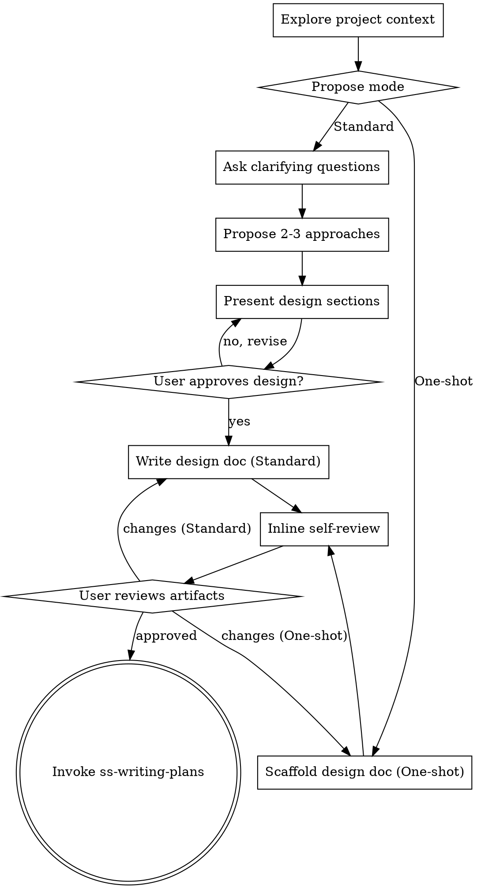

# Brainstorming Ideas Into Designs

Help turn ideas into fully formed designs and specs through natural collaborative dialogue.

Start by understanding the current project context, then choose a mode that fits the work and proceed accordingly.

<HARD-GATE>
Do NOT invoke any implementation skill, write any code, scaffold any project, or take any implementation action until the user has approved a design (or the equivalent One-shot artifact bundle). This applies to EVERY project regardless of perceived simplicity.
</HARD-GATE>

## Anti-Pattern: "This Is Too Simple To Need A Design"

Every project goes through this process. A todo list, a single-function utility, a config change — all of them. "Simple" projects are where unexamined assumptions cause the most wasted work. The design can be short (a few sentences for truly simple projects), but you MUST present it and get approval.

## Modes

There are two modes. Pick one after exploring project context, and propose it to the user.

### Standard (default)

Full collaborative flow. Use when the change has multiple components, unclear trade-offs, or the user is describing a problem rather than a solution.

Clarifying questions → propose approaches → present design section-by-section → write `design.md` → inline self-review → user reviews → handoff to `ss-writing-plans`.

### One-shot

Scaffold the full artifact bundle (`design.md` + `plan.md` + `tasks.md`) in a single pass without the back-and-forth question loop, then ask the user to review all three together. Use when:
- The user has already supplied enough context to design and plan without further questions
- The change follows a well-understood pattern (e.g., "add an endpoint like the existing ones")
- The user explicitly asks to skip the conversation ("just scaffold it", "one-shot it")

One-shot still produces a real `design.md` — it does not skip the design step, it just skips the *dialogue* around it. The user's review of the written artifacts is the approval gate.

If during scaffolding you discover a real ambiguity that affects the design, **stop and ask** rather than guessing. One-shot trades dialogue for momentum; it does not trade correctness.

## Mode Selection

After exploring project context, propose a mode with AskUserQuestion:
- **Standard** — Collaborative design flow with clarifying questions (recommended default)
- **One-shot** — Scaffold design + plan + tasks in one pass, then review together

Lead with the mode you think fits and your reason (e.g., "*This looks like a Standard change because two subsystems need to coordinate.*"). The user can override.

## Checklist

Tasks for each mode. Create todos and complete in order.

### Standard

1. **Explore project context** — files, docs, recent commits
2. **Propose mode** — confirm Standard (see Mode Selection)
3. **Ask clarifying questions** — one at a time; purpose, constraints, success criteria
4. **Propose 2–3 approaches** — with trade-offs and your recommendation
5. **Present design** — in sections scaled to complexity; approval after each section
6. **Write design doc** — create `changes/YYYY-MM-DD-<topic>/`; save `design.md`
7. **Inline self-review** — placeholder scan, internal consistency, scope, ambiguity (see Self-Review)
8. **User reviews written spec** — ask user to review before proceeding
9. **Transition to implementation** — invoke `ss-writing-plans`, passing the change directory path

### One-shot

1. **Explore project context** — files, docs, recent commits
2. **Propose mode** — confirm One-shot (see Mode Selection)
3. **Scaffold design.md** — create `changes/YYYY-MM-DD-<topic>/` and write `design.md` directly from user-supplied context, in a single pass
4. **Inline self-review** — placeholder scan, internal consistency, scope, ambiguity (see Self-Review)
5. **Invoke ss-writing-plans with One-shot signal** — pass the change directory and state `mode: one-shot` in the handoff message; ss-writing-plans will generate `plan.md` and `tasks.md` and skip its execution-mode prompt (defaults to Subagent-Driven), keeping the pass continuous
6. **Bundled user review** — once all three artifacts exist, ask the user to review them together; revise any of them based on feedback

## Process Flow

**The terminal state is invoking ss-writing-plans.** Do NOT invoke frontend-design, mcp-builder, or any other implementation skill from ss-brainstorming.

## The Process

**Understanding the idea:**

- Check out the current project state first (files, docs, recent commits)
- Before asking detailed questions, assess scope: if the request describes multiple independent subsystems (e.g., "build a platform with chat, file storage, billing, and analytics"), flag this immediately. Don't spend questions refining details of a project that needs to be decomposed first.
- If the project is too large for a single spec, help the user decompose into sub-projects: what are the independent pieces, how do they relate, what order should they be built? Then brainstorm the first sub-project through the normal design flow. Each sub-project gets its own spec → plan → implementation cycle.
- For appropriately-scoped projects, ask questions one at a time to refine the idea
- Prefer multiple choice questions using the AskUserQuestion tool when possible, but open-ended is fine too
- Only one question per message — if a topic needs more exploration, break it into multiple questions
- When presenting options, ALWAYS use the AskUserQuestion tool (with its built-in selectable options) instead of asking the user to type A, B, C, etc.
- Focus on understanding: purpose, constraints, success criteria

**Exploring approaches:**

- Propose 2-3 different approaches with trade-offs
- Present options conversationally with your recommendation and reasoning
- Lead with your recommended option and explain why

**Presenting the design:**

- Once you believe you understand what you're building, present the design
- Scale each section to its complexity: a few sentences if straightforward, up to 200-300 words if nuanced
- Ask after each section whether it looks right so far
- Cover: architecture, components, data flow, error handling, testing
- Be ready to go back and clarify if something doesn't make sense

**Design for isolation and clarity:**

- Break the system into smaller units that each have one clear purpose, communicate through well-defined interfaces, and can be understood and tested independently
- For each unit, you should be able to answer: what does it do, how do you use it, and what does it depend on?
- Can someone understand what a unit does without reading its internals? Can you change the internals without breaking consumers? If not, the boundaries need work.
- Smaller, well-bounded units are also easier for you to work with - you reason better about code you can hold in context at once, and your edits are more reliable when files are focused. When a file grows large, that's often a signal that it's doing too much.

**Working in existing codebases:**

- Explore the current structure before proposing changes. Follow existing patterns.
- Where existing code has problems that affect the work (e.g., a file that's grown too large, unclear boundaries, tangled responsibilities), include targeted improvements as part of the design - the way a good developer improves code they're working in.
- Don't propose unrelated refactoring. Stay focused on what serves the current goal.

## After the Design

**Documentation (Standard):**

- Create the change directory: `changes/YYYY-MM-DD-<topic>/`
- Write the validated design (spec) to `changes/YYYY-MM-DD-<topic>/design.md`
  - (User preferences for spec location override this default)
- Use elements-of-style:writing-clearly-and-concisely skill if available

**Documentation (One-shot):**

- Create `changes/YYYY-MM-DD-<topic>/` and write `design.md` in a single pass from the user's supplied context. Don't ask questions you can reasonably infer answers to; **do** stop and ask if you hit a genuine ambiguity.

## Self-Review

After writing `design.md`, look at it with fresh eyes. This is a checklist you run yourself inline — not a subagent dispatch. Fix issues directly; no re-review needed.

**1. Placeholder scan.** Any "TBD", "TODO", incomplete sections, or vague requirements? Fix them.

**2. Internal consistency.** Do any sections contradict each other? Does the architecture match the feature descriptions? Are the same names/types used the same way throughout?

**3. Scope check.** Is this focused enough for a single implementation plan, or does it need decomposition into sub-projects?

**4. Ambiguity check.** Could any requirement be interpreted two different ways? If so, pick one and make it explicit.

**Calibration:** flag only issues that would cause real problems during planning or implementation. Minor wording is not an issue.

## User Review Gate

**Standard:** after self-review, ask the user to review the spec:

> "Spec written to `changes/YYYY-MM-DD-<topic>/design.md`. Please review it and let me know if you want to make any changes before we start writing out the implementation plan."

Wait for the user. If they request changes, make them and re-run the self-review. Only proceed once approved.

**One-shot:** the user review is **bundled** — review only happens after `design.md`, `plan.md`, and `tasks.md` are all written. Ask:

> "All three artifacts written: `design.md`, `plan.md`, `tasks.md` under `changes/YYYY-MM-DD-<topic>/`. Please review them together and let me know if you want changes to any of them."

Revise any of the three based on feedback, then re-run self-review on whatever changed.

## Implementation Handoff

- Invoke the ss-writing-plans skill to create the implementation plan
- Do NOT invoke any other skill. ss-writing-plans is the next step.

## Key Principles

- **One question at a time** — Don't overwhelm with multiple questions
- **Multiple choice preferred** — Use AskUserQuestion tool for selectable options instead of text-based A/B/C
- **YAGNI ruthlessly** — Remove unnecessary features from all designs
- **Explore alternatives** — Always propose 2-3 approaches before settling (Standard mode)
- **Incremental validation** — Present design, get approval before moving on (Standard); bundle review at the end (One-shot)
- **Be flexible** — Go back and clarify when something doesn't make sense

## Visuals

For visual content (mockups, wireframes, architecture diagrams, layout comparisons), use **ASCII diagrams** inline in the conversation. They render reliably across every harness, cost nothing in infrastructure, and are sufficient for the level of fidelity brainstorming needs. If the user asks for richer visuals, suggest they sketch in their tool of choice and paste / link images back into the conversation.
