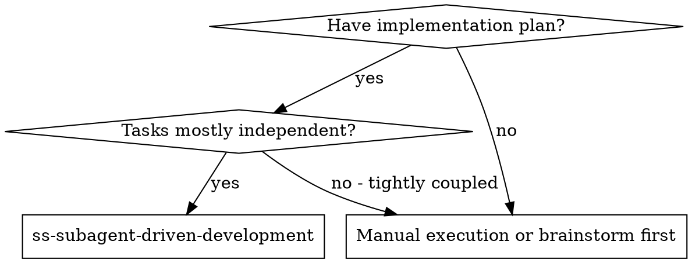
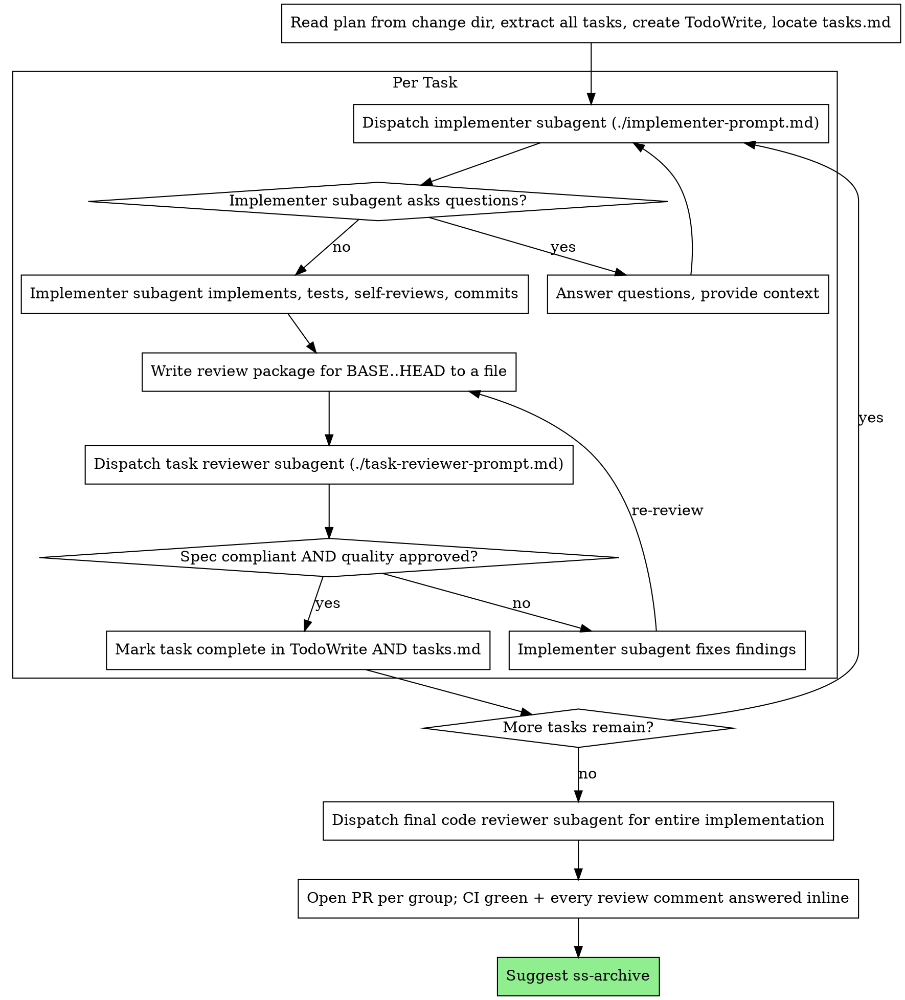

# Subagent-Driven Development

Execute plan by dispatching a fresh subagent per task, with one task review after each that returns two verdicts: spec compliance and code quality.

**Why subagents:** You delegate tasks to specialized agents with isolated context. By precisely crafting their instructions and context, you ensure they stay focused and succeed at their task. They should never inherit your session's context or history — you construct exactly what they need. This also preserves your own context for coordination work.

**Core principle:** Fresh subagent per task + one task review carrying both verdicts = high quality, fast iteration

<GIT-GUARDRAIL>
You DO drive the branch → commit → push → open-PR → rebase-the-stack → clean-up flow yourself (see *Worktrees and Stacked PRs*).

**Allowed, and expected:**
- **rebase + `git push --force-with-lease`**, but ONLY on a branch belonging to a PR **you opened in this session**. Maintaining a stack is impossible without it.
- **deleting a worktree and a branch** — but only after you have confirmed its PR actually merged (see *After the user says it merged*).

**Never:**
- **bare `git push --force`.** `--force-with-lease` or nothing; the lease is what stops you from silently discarding someone else's push.
- **force-pushing anything you did not open** — a base branch (`main`/`master`/`develop`), a shared branch, or somebody else's PR branch. Not even to "fix" it.
- **merging.** Neither `git merge` into a base branch nor merging the PR itself. **The user merges.** After you open a PR, you wait.

Read-only git (status, log, diff, rev-parse) is always fine. If the flow seems to need something outside these boundaries, stop and ask instead of finding a way around it.
</GIT-GUARDRAIL>

## When to Use



This is the only execution mode. Tightly-coupled work that can't be split into independent tasks doesn't get executed inline as a fallback — it goes back to the plan, because "one subagent can't do this alone" usually means the tasks were cut wrong.

**What you get:**
- Fresh subagent per task (no context pollution)
- One task review after each task, returning both a spec-compliance and a code-quality verdict
- Faster iteration (no human-in-loop between tasks)
- Each PR-sized group of tasks lands as its own PR (see *Worktrees and Stacked PRs*)

## The Process



## Dual Task Tracking

Use **both** tracking mechanisms:

1. **TodoWrite** (in-session) — ephemeral, dies with the conversation. Use for real-time progress visibility.
2. **tasks.md** (persistent) — lives in the change directory (`changes/YYYY-MM-DD-<topic>/tasks.md`). Survives across conversations, and survives compaction.

When marking a task complete, always do both: update TodoWrite AND edit tasks.md.

**`tasks.md` is the record of what happened, not just what is left.** Your own memory of this session does not survive compaction; a controller that has lost its place will happily re-dispatch a task sequence it already finished. Write state down as it happens:

- Flip the checkbox `- [ ]` → `- [x]` when the task's review comes back clean.
- Annotate the task line underneath with the evidence:
  `commits <base7>..<head7> · review clean` (or `· 2 findings fixed`).
- Keep the **Execution State** block at the top of the file current — worktree path, and one line per PR: `PR #123 feat/a → develop (tasks 1-3) · CI green · 4 comments answered`. After a restack, append what moved: `feat/b rebased --onto origin/develop feat/a · force-pushed`.

**After a compaction, trust `tasks.md` and `git log` over your own recollection.** The commits it names exist in git whether or not you remember making them. Resuming a partially-completed plan works the same way: read `tasks.md` first, resume at the first task without an `- [x]`.

**Do not create a second progress file.** One record per change; a sibling ledger duplicates the task list and the two drift apart.

## Commits and the Review Diff

Each implementer commits its own task's work before reporting. This is what makes the review real: the task reviewer reviews a **diff**, and a task that left nothing committed produces an empty diff and a review that approves nothing at all — silently, and marked green.

- **Record BASE before dispatching:** run `git rev-parse HEAD` in the worktree and keep it. That is the task's base.
- **Never derive the base from `HEAD~1`.** A task that took three commits would silently review only the last one.
- The implementer commits; it does **not** push, branch, rebase, or open PRs. Those happen at the PR-group boundary and are yours (see *Worktrees and Stacked PRs*).
- After the fix loop, the re-review's base is the head the previous review saw — review the fix, not the whole task again.

## Handing Work Over as Files

Everything you paste into a dispatch prompt, and everything a subagent prints back, stays in your context for the rest of the session and is re-read on every later turn. A task's full text pasted N times is that text sitting in your context N times.

So hand over **paths**, not contents:

- **The task:** give the implementer the **absolute path to `plan.md`** plus "implement Task N only — do not touch any other task". The subagent spends one Read; its context is disposable, yours is not. Do not paste the task body.
- **The report:** the implementer writes its full report to `changes/YYYY-MM-DD-<topic>/task-N-report.md` and returns only status, commit range, a one-line test summary, and concerns. Reports belong to the change packet — they are part of its decision trail and get archived with it.
- **The diff:** write the review package to a file and give the reviewer its path — never let diff output land in your context:
  ```
  mkdir -p "$TMPDIR/superspec/<topic>"
  { git log --oneline BASE..HEAD; git diff --stat BASE..HEAD; git diff -U10 BASE..HEAD; } \
    > "$TMPDIR/superspec/<topic>/task-N-review.diff"
  ```
  **Review packages are scratch, not artifacts** — keep them outside the repo. A diff committed into the change directory duplicates what git already stores, bloats the packet, and gets dragged into the archive forever.

What you still compose yourself is the part no file can carry: one line on where this task fits, the interfaces and decisions earlier tasks established, and your resolution of any ambiguity you spotted. A dispatch prompt describes **one task** — never paste accumulated "state after Tasks 1-3" summaries into later dispatches.

## Model Selection

Use the least powerful model that can handle each role to conserve cost and increase speed.

**Mechanical implementation tasks** (isolated functions, clear specs, 1-2 files): use a fast, cheap model. Most implementation tasks are mechanical when the plan is well-specified.

**Integration and judgment tasks** (multi-file coordination, pattern matching, debugging): use a standard model.

**Architecture, design, and review tasks**: use the most capable available model.

**Task complexity signals:**
- Touches 1-2 files with a complete spec → cheap model
- Touches multiple files with integration concerns → standard model
- Requires design judgment or broad codebase understanding → most capable model

## Handling Implementer Status

Implementer subagents report one of four statuses. Handle each appropriately:

**DONE:** Write the review package for BASE..HEAD to a file, then dispatch the task reviewer with its path.

**DONE_WITH_CONCERNS:** The implementer completed the work but flagged doubts. Read the concerns before proceeding. If the concerns indicate a design mismatch (plan assumptions vs reality), handle as a **design deviation** (see below). If they're about correctness or scope, address them before review. If they're observations (e.g., "this file is getting large"), note them and proceed to review.

**NEEDS_CONTEXT:** The implementer needs information that wasn't provided. Provide the missing context and re-dispatch.

**BLOCKED:** The implementer cannot complete the task. Assess the blocker:
1. If it's a context problem, provide more context and re-dispatch with the same model
2. If the task requires more reasoning, re-dispatch with a more capable model
3. If the task is too large, break it into smaller pieces
4. If the plan itself is wrong, escalate to the human
5. If the blocker is a design mismatch (plan assumptions don't match reality), handle as a **design deviation** (see below)

**Never** ignore an escalation or force the same model to retry without changes. If the implementer said it's stuck, something needs to change.

## Design and Plan Are Living Documents

Artifacts (`design.md`, `plan.md`, `tasks.md`) are mutable throughout implementation, not frozen at handoff. Implementation will surface things the design didn't anticipate — that's normal, not an exception. Treat updating an artifact as a routine part of the workflow.

**Two paths:**

**Inline adjustments — no escalation needed.** Implementer or controller can adjust without pausing:
- Minor implementation details (variable names, exact line numbers, file layout)
- Test adjustments for framework quirks
- Small scope adjustments that don't change design intent
- Adding a sub-step that was implied but not written
- Tightening a task description after learning what it actually involves

Just do it, note the change in `tasks.md` as a brief comment if it would surprise a future reader.

**Design deviation — surface and let the user decide.** When the implementer hits something that changes design *intent*:
- Plan assumes an API / dependency / pattern that doesn't exist or works differently
- Task's approach conflicts with actual codebase architecture
- A design requirement is impossible or impractical as specified
- Discovery would meaningfully change how someone would have designed the system if they'd known

The protocol:

1. **Pause** the current task
2. **Surface** to the user: what was expected (from plan/design) vs what was found, and why it matters
3. **User decides** via AskUserQuestion:
   - **Update artifacts and continue** — Edit `design.md` and/or `plan.md`, add note `> Updated during implementation: [reason]`, review and adjust remaining tasks, then resume
   - **Proceed as-is** — Continue with the pragmatic fix; note the deviation in `tasks.md` as a comment below the task checkbox
   - **Rethink** — Drop back to brainstorming-level discussion about the approach

After the user decides and any artifact updates are made, resume the normal per-task flow from where it was paused.

**The split is about user-decision-worthiness, not severity.** Anything that would change how the user would have designed the system needs their input. Anything that doesn't is just implementation work — adjust and keep going.

## Prompt Templates

- `./implementer-prompt.md` - Dispatch implementer subagent
- `./task-reviewer-prompt.md` - Dispatch task reviewer subagent (spec compliance + code quality, one dispatch)
- `./code-reviewer.md` - The broad reviewer, used once for the final whole-implementation review

## Example Workflow

```
You: I'm using Subagent-Driven Development to execute this plan.

[Worktree ready; read plan once: /abs/.../changes/2026-08-09-hooks/plan.md — 5 tasks]
[Locate tasks.md in same directory; Execution State block is empty — fresh start]
[Create TodoWrite with all tasks]

Task 1: Hook installation script

[git rev-parse HEAD → BASE=a1b2c3d]
[Dispatch implementer: plan.md path, "Task 1 only", scene-setting, report-file path]

Implementer: "Before I begin - should the hook be installed at user or system level?"

You: "User level (~/.config/superpowers/hooks/)"

Implementer: [Later] DONE — commits a1b2c3d..d4e5f6a, 5/5 passing, report written.
  Self-review found a missing --force flag; added it.

[Write review package a1b2c3d..d4e5f6a to $TMPDIR/superspec/hooks/task-1-review.diff]
[Dispatch task reviewer with brief context + report path + diff path]
Task reviewer: Spec ✅ — all requirements met, nothing extra.
  Strengths: good test coverage, clean. Issues: none. Task quality: Approved.

[tasks.md: - [x] Task 1 … / commits a1b2c3d..d4e5f6a · review clean]

Task 2: Recovery modes

[git rev-parse HEAD → BASE=d4e5f6a]
[Dispatch implementer: plan.md path, "Task 2 only", interfaces Task 1 established]

Implementer: DONE — commits d4e5f6a..b7c8d9e, 8/8 passing, report written.

[Write review package d4e5f6a..b7c8d9e to task-2-review.diff; dispatch task reviewer]
Task reviewer: Spec ❌ — missing progress reporting (spec says "report every 100 items");
  extra --json flag not requested.
  Issues (Important): magic number 100. Task quality: Needs fixes.

[Implementer fixes both, re-runs the covering tests, appends to its report file]
Implementer: Removed --json, added progress reporting, extracted PROGRESS_INTERVAL. 10/10 passing.

[Write review package b7c8d9e..e1f2a3b (the fix range only); re-dispatch]
Task reviewer: Spec ✅. Both findings addressed (recovery.js:41, recovery.js:7). Approved.

[tasks.md: - [x] Task 2 … / commits d4e5f6a..e1f2a3b · 2 findings fixed]

...

[After all tasks: dispatch final code reviewer over the whole implementation]
Final reviewer: All requirements met, ready to merge

[Open the PR for this group; tasks.md Execution State gets the PR line]

Done!
```

## Advantages

**vs. Manual execution:**
- Subagents follow TDD naturally
- Fresh context per task (no confusion)
- Parallel-safe (subagents don't interfere)
- Subagent can ask questions (before AND during work)

**vs. Executing Plans:**
- Same session (no handoff)
- Continuous progress (no waiting)
- Review checkpoints automatic

**Efficiency gains:**
- Artifacts move as file paths, so plan text and diffs never accumulate in the controller's context
- Controller curates exactly what context is needed
- Questions surfaced before work begins (not after)

**Quality gates:**
- Self-review catches issues before handoff
- One task review carrying both verdicts: spec compliance prevents over/under-building, code quality ensures it is well-built
- Review loops ensure fixes actually work
- Every review reads a real committed diff, so an empty task cannot pass

**Cost:**
- More subagent invocations (implementer + 1 reviewer per task)
- Review loops add iterations
- But catches issues early (cheaper than debugging later)

## Red Flags

**Never:**
- Start implementation on main/master branch without explicit user consent
- Skip the task review, or accept a review report missing either verdict
- Proceed with unfixed issues
- Dispatch multiple implementation subagents in parallel (conflicts)
- **Paste a task's full text into a dispatch prompt** — hand over the path to `plan.md` and name the task
- **Dispatch a reviewer without a committed diff** — an empty range produces an approval that means nothing
- Derive a task's base from `HEAD~1` instead of the BASE you recorded before dispatching
- Let `git diff` output land in your own context instead of a file
- Skip scene-setting context (subagent needs to understand where task fits)
- Ignore subagent questions (answer before letting them proceed)
- Accept "close enough" on spec compliance (reviewer found issues = not done)
- Skip review loops (reviewer found issues = implementer fixes = review again)
- Let implementer self-review replace the task review (both are needed)
- Move to next task while the review has open issues
- Silently deviate from design intent without surfacing it (see Design and Plan Are Living Documents)
- Decide to update or skip artifacts on behalf of the user (always escalate)

**If subagent asks questions:**
- Answer clearly and completely
- Provide additional context if needed
- Don't rush them into implementation

**If reviewer finds issues:**
- Implementer (same subagent) fixes them
- Reviewer reviews again
- Repeat until approved
- Don't skip the re-review

**If subagent fails task:**
- Dispatch fix subagent with specific instructions
- Don't try to fix manually (context pollution)

## Worktrees and Stacked PRs

This is the default shipping shape, not an opt-in. The plan already says which tasks belong to which PR; this section says how those groups reach GitHub.

### One worktree per repo

Work in a git worktree, not the main checkout — the user very likely has other sessions and other branches in flight, and a shared checkout makes two agents fight over one index.

1. `git fetch origin` and branch from `origin/<base>` directly. Do not `git pull` the current branch.
2. Put the worktree at `.worktrees/<kebab-topic>/` inside the repo.
3. Copy the gitignored env files the repo needs (`.env*`, `.npmrc`, …) — they are absent in a fresh worktree by definition, and their absence usually surfaces as a confusing runtime error, not a missing-file error.
4. Install dependencies in the worktree.
5. Check the repo's own conventions file (`CLAUDE.md` / `AGENTS.md` / `CONTRIBUTING.md`) for a worktree recipe and prefer it over these steps.

**One worktree serves a whole stack.** Stacked PRs are sequential by construction, so reuse the same worktree and create each next branch inside it — that also keeps the base relationships obvious and saves repeated dependency installs.

### Stacking

Each PR's branch is based on the previous PR's branch, not on the base branch:

- PR1: `feat/a` → base `develop`
- PR2: `feat/b` → base `feat/a`
- PR3: `feat/c` → base `feat/b`

Open each PR with its real base and say in the body which PR it is stacked on and in what order they should merge.

### Keeping the stack current: rebase, and force-push with a lease

A stack is maintained by **rebasing**, and rebasing a pushed branch means force-pushing it. That is allowed here — see the guardrail for the exact boundary — and it is the right tool: the alternative (merging the base forward) leaves a merge commit in every downstream branch and, after a squash merge, produces a guaranteed conflict on every single PR in the stack.

Always `--force-with-lease`, never bare `--force`. The lease is what turns "I am rewriting my own branch" into "I am rewriting my own branch **and nobody else pushed to it while I wasn't looking**".

**After the user merges PR1, the branch below is NOT rebased with a plain `git rebase origin/develop`.** A squash merge collapsed PR1 into one new commit on the base; a plain rebase would try to replay PR1's original commits on top of it and conflict with itself. Cut them off explicitly with the old base branch as the upstream:

```
git fetch origin
git checkout feat/b
git rebase --onto origin/develop feat/a    # replay ONLY feat/a..feat/b onto the new base
git push --force-with-lease
```

Then repeat down the stack (`--onto origin/develop feat/b` for `feat/c`, and so on).

**Sequencing constraint: rebase the whole stack before deleting the merged branch.** `feat/a` is the ref that tells `--onto` where PR2's own commits begin. Delete it first and you have to hunt for the SHA by hand.

If you fixed something in PR1 while PR2 already existed, same move: rebase `feat/b` onto the updated `feat/a` and force-push with a lease.

A rebase can still conflict. When it does, resolving it is usually "keep our side", but **verify that mechanically instead of trusting it** — check that nothing which existed on the other side got dropped (for a test file, compare the list of test names on both sides; for source, list the lines that exist only on the other side and account for each one). A conflict resolved by taking one side wholesale is exactly where a silently-duplicated declaration or a lost test hides.

### After opening a PR

Opening the PR is not the end of the task. Finish these before reporting the PR as done:

1. **Wait for CI and read it.** Poll until every check settles. A summary/aggregate job failing usually just means one real job failed — find the real one and read its log rather than guessing from the name.
2. **Read the PR's review comments** — bots included. There are two kinds and both matter: line-anchored review comments, and the review's summary body.
3. **Judge each comment on the code, not on its tone.** Open the file and check the claim. A confident bot is often right and sometimes wrong; both outcomes need evidence.
4. **Fix what is real.** If you disagree, that is a legitimate outcome — but it has to be argued, not ignored.
5. **Reply to every comment, inline in its own thread.** Say what you changed (with the commit) or why you are not changing it. If a fix has no test covering it, say so in the reply instead of letting it read as verified. Do not answer a line-anchored comment with a new top-level comment — it loses the anchor.
6. **A stacked PR gets these fixes on its own branch**, then rebase the PRs above it onto it and force-push with a lease, so the stack stays consistent.

Then hand back to the user: they merge. If CI is red for a reason you cannot attribute to your change (a known flake, an unrelated job), say that explicitly and say what evidence you have — never report red CI as green, and never re-run a job repeatedly hoping it turns.

### After the user says it merged

"merged" is a trigger, not just news. Do all of this without being asked again:

1. **Verify it actually landed — from the base branch, not from the PR page.** `git fetch origin`, confirm the PR reads `MERGED`, then read the change back out of `origin/<base>` (e.g. grep `git show origin/<base>:<path>` for something the change introduced). A green PR page and landed content are two different claims, and a squash or rebase merge rewrites the SHA, so you cannot match commits by hash.
2. **Rebase everything below it in the stack** and force-push with a lease (see *Keeping the stack current*). Do this **before** step 3 — the merged branch is the ref that rebase needs.
3. **Delete the worktree, then the branch.** Worktree first: a branch checked out in a worktree cannot be deleted. Expect to need `-D` rather than `-d`, because a squash or rebase merge leaves the branch at a different SHA than what landed and git therefore does not consider it merged. That is precisely why step 1 exists — `-D` discards git's own safety check, so the evidence has to come from the read-back instead.
4. **Report what you deleted**, and leave alone anything whose provenance you cannot establish. A branch you did not open in this session is not yours to clean up, however stale it looks — say it is there and let the user decide.

If several PRs merge at once, do steps 1–3 in stack order, bottom-up.
