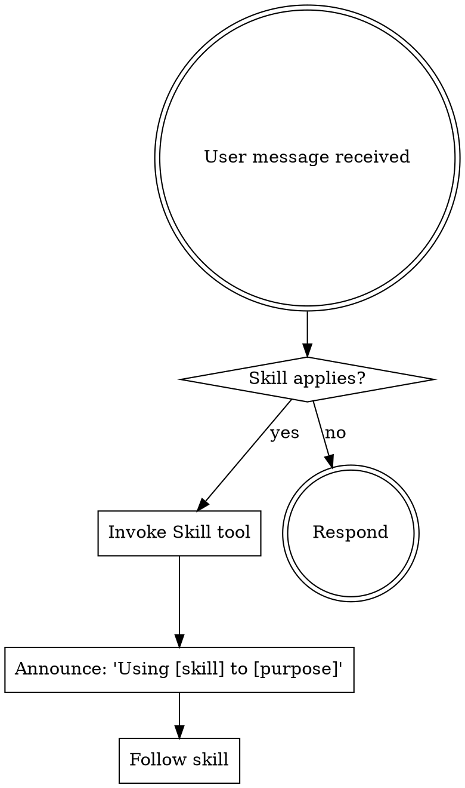

<SUBAGENT-STOP>
If you were dispatched as a subagent to execute a specific task, skip this skill.
</SUBAGENT-STOP>

## Instruction Priority

Superspec skills override default system prompt behavior, but **user instructions always take precedence**:

1. **User's explicit instructions** (CLAUDE.md, direct requests) — highest priority
2. **Superspec skills** — override default system behavior where they conflict
3. **Default system prompt** — lowest priority

If CLAUDE.md says "don't use TDD" and a skill says "always use TDD," follow the user's instructions.

## How to Access Skills

Use the `Skill` tool. When you invoke a skill, its content is loaded and presented to you — follow it directly. Never use the Read tool on skill files.

# Using Skills

## The Rule

**Invoke relevant skills BEFORE any response or action.** If a skill clearly applies to what you're about to do, invoke it first.

## Skill Priority

When multiple skills could apply, use this order:

1. **Process skills first** (ss-brainstorming) — determines HOW to approach the task
2. **Implementation skills second** (ss-subagent-driven-development) — guides execution

"Let's build X" → ss-brainstorming first, then implementation skills.

## Git Guardrail

Superspec skills do NOT execute git write commands (commit, push, merge, rebase, branch delete). The user handles their own git workflow. Read-only git commands (status, log, diff) are fine for gathering information.
